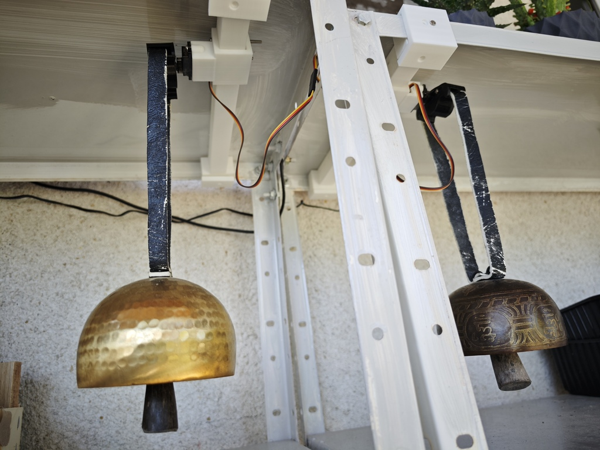
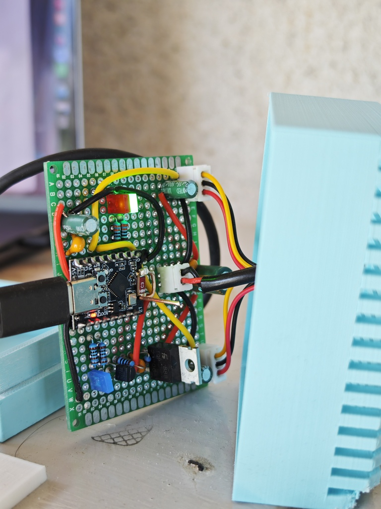

# Tibetan Clock — Firmware

PlatformIO + Arduino firmware for an ESP32-C3 SuperMini that drives two MG90S servos to strike Tibetan singing bowls, controllable from Home Assistant over MQTT.



## Hardware

**MCU**: ESP32-C3 SuperMini (160 MHz single-core RISC-V, 4 MB embedded flash, USB-Serial/JTAG).

**Servos**: 2× MG90S, driven via 50 Hz PWM (14-bit duty resolution, 600 µs–2400 µs pulse, 90° = neutral).

**Servo power gate**: N-channel MOSFET (or similar) on the servo rail. Gate driven by GPIO 6. **Blue LED** on the board lights when the gate is conducting (hardware indicator, not firmware-controlled).

**Status LEDs**: 2× LEDs (green = success, red = error) directly driven by GPIOs 0 and 1.



### Pinout

| GPIO | Direction | Role | Notes |
|------|-----------|------|-------|
| 0 | OUT | Status LED — green | active-high |
| 1 | OUT | Status LED — red | active-high |
| 3 | OUT (PWM) | Bell A servo signal | LEDC, 50 Hz, 14-bit |
| 4 | OUT (PWM) | Bell B servo signal | LEDC, 50 Hz, 14-bit |
| 6 | OUT | Bell power MOSFET gate | active-high (`BELL_POWER_ACTIVE_HIGH=1`); blue LED comes on when high |
| USB | – | USB-Serial/JTAG (`Serial`) | flashing + console |

Polarity of GPIO 6 is configurable via `BELL_POWER_ACTIVE_HIGH` in `src/servo.h`.

### Schematic (logical)

```
          +5V (servo rail) ───┬──────────────┐
                              │              │
                         [MOSFET S]      [Blue LED]
                              │              │
GPIO6 ──[gate]── (rail) ──[MOSFET D] ────────┘  (LED indicates rail powered)
                                              │
                                              ├──────► Bell A servo VCC
                                              └──────► Bell B servo VCC

GPIO3 ──────────────────────────────────────────────► Bell A servo SIG
GPIO4 ──────────────────────────────────────────────► Bell B servo SIG
GND  ───────── common to ESP32, both servos, MOSFET source

GPIO0 ──[R]──[Green LED]── GND
GPIO1 ──[R]──[Red LED] ──── GND

USB-C ── ESP32-C3 SuperMini USB (debug + power for the MCU)
```

> The ESP32 is USB-powered; the servo rail is a separate +5 V supply gated by the MOSFET. **Don't share** the MCU's 3V3 pin with the servos — under stall they spike enough current to brown the MCU out (this is why the firmware sleeps `capacitor_stabilization_ms` after toggling the gate).

## Architecture

The firmware is split into small modules, each with a `Begin/Tick` (or `Init`) pair so `loop()` stays simple.

```
firmware/
├── platformio.ini             pioarduino fork, esp32-c3-devkitm-1, secrets via extra_configs
├── private_config.ini.template build_flag stanza for WiFi/MQTT secrets
├── private_config.ini          gitignored — local credentials
└── src/
    ├── main.cpp                setup() init order, loop() pumps each module's Tick
    ├── servo.{h,cpp}           bell ring algorithm + rail power manager
    ├── config.{h,cpp}          NVS-persisted per-bell intensity / count / center trim
    ├── leds.{h,cpp}            LED state machine (Booting / WifiConnecting / Connected / Error / Ringing)
    ├── wifi_conn.{h,cpp}       WiFi STA, auto-reconnect, exponential backoff
    └── mqtt.{h,cpp}            PubSubClient + ArduinoJson, HA discovery, command dispatch
```

### Servo / ring algorithm

The servo arm sits at its per-bell `center` (~90°). A single ring is a **wind-up + release**:

1. **Rail-up** (skipped if rail is already powered from a recent ring). Staggered cold-start: pre-arm only the targeted servo's PWM line at center, energize the MOSFET, wait `RAIL_WARMUP_MS` (1 s) for the cap to charge with a single servo loaded, then pre-arm the other servo. Avoids brownouts caused by both MG90S seeking center simultaneously through a charging cap.
2. Re-issue the targeted servo at center (in case it drifted between rings), sleep `capacitor_stabilization_ms`.
3. Repeat `count` times:
   a. **Wind-up** (Phase A, `swing_up_step_ms` per degree): rotate the arm slowly from `center` to `center + intensity`, *away* from the bowl. The arm is being charged with potential energy.
   b. Hold `release_pause_ms` (500 ms) at the wind-up position.
   c. **Release** (Phase B, `swing_down_step_ms` per degree): drive the arm back to `center`. With `swing_down_step_ms = 0` (default), this is an instant snap — the arm whips back through the bowl and rings it.
   d. Pad remaining time to `cycle_ms` (5 s default) before the next strike.
4. Re-center both servos to their per-bell centers (the un-commanded bell may drift under brownout pressure during the snap).
5. **Schedule** a MOSFET-off `RAIL_IDLE_HOLD_MS` (1.5 s) in the future, executed by `servoTick()` from the main loop. If another `ringBell` lands inside that window, the schedule is cancelled and the rail stays up — back-to-back rings share a single power cycle.

> The reference implementation rang the bowl on the *out* swing and used the slow step-back to settle. This port rings on the *back* swing — gentle wind-up, snap release. Both modes are reachable: set `swing_up_step_ms = 0` and `swing_down_step_ms > 0` to flip the strike phase.

### MQTT / Home Assistant integration

Auto-discovery via the `homeassistant/...` topic prefix. The device exposes **3 buttons + 9 number sliders** (all under one HA device entry "Tibetan Clock"), plus an availability binary sensor. The bell number for ring commands is taken **from the topic, not the payload**.

**Entities:**

| HA entity | Component | Range | Default | Section |
|-----------|-----------|-------|---------|---------|
| `Ring Bell A` | button | – | – | Controls |
| `Ring Bell B` | button | – | – | Controls |
| `Calibrate` | button | – | – | Controls |
| `Bell A Intensity` | number | 5–50° | 28 | Configuration |
| `Bell B Intensity` | number | 5–50° | 20 | Configuration |
| `Bell A Count` | number | 1–9 | 1 | Configuration |
| `Bell B Count` | number | 1–9 | 3 | Configuration |
| `Bell A Center` | number | 60–120° | 90 | Configuration |
| `Bell B Center` | number | 60–120° | 85 | Configuration |
| `Swing Up Step` | number | 0–30 ms | 20 | Configuration — wind-up speed (ms per degree) |
| `Swing Down Step` | number | 0–10 ms | 0 | Configuration — release speed (ms per degree). 0 = snap = ring |
| `Strike Cycle` | number | 500–10000 ms | 5000 | Configuration — total time per strike in a multi-strike ring |

The `Bell X Intensity` / `Count` / `Center` sliders are persisted in NVS and used as defaults when `Ring Bell X` is pressed without a payload (or with HA's default `"PRESS"` body).

Pressing `Ring Bell A` with an explicit JSON payload overrides per-press:

```json
{ "intensity": 30, "count": 3 }
```

**Calibration workflow:** Press `Calibrate` → the rail powers up and both servos hold at their per-bell centers for 10 s. While holding, dragging `Bell A/B Center` sliders moves the corresponding servo live (each slider change resets the 10 s timer). When alignment looks right, stop interacting; after 10 s of inactivity the rail powers off.

**Topics** (`homeassistant/...` prefix):

| Topic | Direction | Retain | Notes |
|-------|-----------|--------|-------|
| `binary_sensor/tibetan_clock/availability` | publish | yes | `online` / `offline`. LWT auto-publishes `offline` on unclean disconnect — HA depends on this. |
| `binary_sensor/tibetan_clock/state` | publish | no | `ringing` / `idle` (informational) |
| `button/tibetan_clock/ring_bell_a/config` + `_b/config` + `calibrate/config` | publish | yes | discovery payloads for the 3 buttons |
| `button/tibetan_clock/ring_bell_a/command` + `_b/command` + `calibrate/command` | subscribe | – | trigger ring or calibration |
| `number/tibetan_clock/bell_{a,b}_{intensity,count,center}/{config,state,set}` | bidirectional | state retained | per-bell config sliders |
| `number/tibetan_clock/{swing_up,swing_down,cycle}/{config,state,set}` | bidirectional | state retained | global timing sliders |

#### PubSubClient gotchas baked into the code

- `setBufferSize(1024)` is called **before** `connect()` (calling after has no effect on outgoing publishes — [issue #764](https://github.com/knolleary/pubsubclient/issues/764)).
- `setKeepAlive(60)` so a 12 s ring doesn't trip the default 15 s keepalive.
- Commands are **deferred to the main loop**, not run inside the MQTT callback — ringing inside the callback would starve `client.loop()` for ~12 s.

## Build / flash / monitor

PlatformIO is at `/Users/gre/.platformio/penv/bin/pio`. Add it to your shell PATH:

```sh
export PATH="$HOME/.platformio/penv/bin:$PATH"
```

Then:

```sh
cd firmware
pio run                                                # build
pio run -t upload --upload-port /dev/cu.usbmodem2101  # flash
pio device monitor --port /dev/cu.usbmodem2101 --echo  # serial console
```

The `--echo` flag enables local echo so you can see what you type. Exit with **Ctrl+C**.

> If `pio run -t upload` reports "could not open port", a serial monitor is holding the port — close it first. The C3's USB-Serial/JTAG also re-enumerates between flash stages; if a single upload fails mid-write, just rerun.

### Configuration

`platformio.ini` pulls secrets from `private_config.ini` via `extra_configs`. The latter is gitignored — copy from the template to set up a fresh checkout:

```sh
cp firmware/private_config.ini.template firmware/private_config.ini
$EDITOR firmware/private_config.ini
```

Defines (all required for networking):

- `WIFI_SSID`, `WIFI_PASSWORD`
- `MQTT_HOST`, `MQTT_PORT` (default 1883)
- `MQTT_USER`, `MQTT_PASSWORD`
- `MQTT_CLIENT_ID`

Backslash-escape internal quotes: `-DWIFI_SSID=\"YourSSID\"`.

Other compile-time toggles (in `platformio.ini`):

- `ENABLE_NETWORKING=0` — strips out WiFi/MQTT init for pure servo testing (M1 mode).

## Serial commands

The boot is silent (no self-test ring). The serial console accepts the same kind of commands as MQTT, plus a couple of diagnostics:

| Command | Action |
|---------|--------|
| `0` | Ring Bell A using its configured intensity / count from NVS |
| `1` | Ring Bell B using its configured intensity / count from NVS |
| `0 30 3` | Bell A, override to intensity 30, 3 strikes (NVS values not changed) |
| `1 50 1` | Bell B, override to intensity 50, 1 strike |
| `p` | Toggle MOSFET (blue LED on/off, no servo motion) — diagnostic |
| `s 0` / `s 1` | Sweep one servo 60→120→90 without striking — diagnostic |
| `?` | Help |

## Status LEDs

Centralized through `leds.{h,cpp}` so WiFi and MQTT layers don't fight over them.

| State | Green | Red |
|-------|-------|-----|
| Booting | fast blink | fast blink |
| Connecting WiFi | off | slow blink |
| WiFi connected | solid | off |
| MQTT connected | solid | off |
| Ringing | fast blink | off |
| Error | off | solid |

## NVS layout

Persistent values live under the `tibetan` Preferences namespace (`config.cpp`):

| Key | Type | Range | Default (A / B) |
|-----|------|-------|-----------------|
| `ver` | uint16 | – | schema version (currently 8 — bumping resets all values to defaults) |
| `int_a` / `int_b` | uint8 | 5–50° | 28 / 20 |
| `cnt_a` / `cnt_b` | uint8 | 1–9 | 1 / 3 |
| `ctr_a` / `ctr_b` | uint8 | 60–120° | 90 / 85 |
| `sup` | uint8 | 0–30 ms | 20 (wind-up step) |
| `sdn` | uint8 | 0–10 ms | 0 (release step — snap) |
| `cyc` | uint16 | 500–10000 ms | 5000 (strike cycle) |

Values are clamped on load; flash is rewritten only if clamping actually changed a value.

## Home Assistant automation example

Once the device shows up in HA, you can drive it from automations like any other entity. This one rings Bell A every hour on the hour, but only while the sun is up:

```yaml
alias: Tibetan clock — hourly chime (daytime only)
description: Ring Bell A every hour, skip if the sun is down
triggers:
  - trigger: time_pattern
    minutes: 0
conditions:
  - condition: state
    entity_id: sun.sun
    state: above_horizon
actions:
  - action: button.press
    target:
      entity_id: button.ring_bell_a
mode: single
```

`button.press` sends an empty payload, so the ring uses whatever the `Bell A Intensity` / `Count` sliders are currently set to. To override per-press, publish a JSON body directly:

```yaml
actions:
  - action: mqtt.publish
    data:
      topic: homeassistant/button/tibetan_clock/ring_bell_a/command
      payload: '{"intensity": 25, "count": 1}'
```

The exact entity_id (`button.ring_bell_a` vs `button.tibetan_clock_ring_bell_a`) depends on how HA slugified your device name — check Settings → Devices & Services → Tibetan Clock to confirm.

## License

GPL v3 — see [`LICENSE`](LICENSE).
